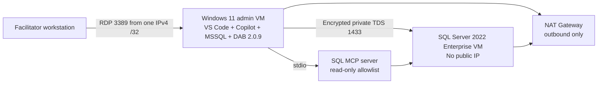

# MCP SQL Query Store Workshop

A six-hour, instructor-led L400 lab for senior SQL Server administrators and performance engineers. The workshop shows how GitHub Copilot can help a DBA investigate and optimize a stored procedure when every conclusion is grounded in allowlisted Microsoft SQL MCP evidence, MSSQL execution-plan analysis, Query Store, and repeatable measurements.

The primary goal is not autonomous tuning. Copilot explains and proposes; the DBA approves, proves result equivalence, measures under frozen conditions, and decides.

## Architecture

Only the Windows 11 administration VM has a public IP. Public RDP is restricted to the facilitator's confirmed IPv4 `/32`. **The SQL VM has no public IP.** Both private subnets use explicit NAT outbound access.

## Quick start

1. Read [Module 00](workshop/00-orientation.md) and accept the safety, licensing, cost, and evidence contract.
2. Prepare development dependencies using [the offline-first guide](docs/offline-dependencies.md). Python supports repository validation and static-site generation only; the deployed workshop runtime has **no PyPI dependency**.
3. Run the local validation entry point: `./build/Test-Repository.ps1`.
4. Follow [the deployment module](workshop/03-deploy-with-powershell.md). A passing preflight and reviewed plan card are mandatory before separate billable-deployment approval.
5. Follow modules 04–06 in order, then perform verified teardown in [Module 07](workshop/07-teardown.md).

## Target and evidence truthfulness

[!TARGET] The experiment targets 75–85% baseline and 35–45% optimized utilization of the isolated Resource Governor regular query-workspace semaphore under unchanged conditions. These are approximately 80% and 40%; they are not current measurements and not a Task Manager memory target.

The repository contains no executed benchmark result. Only a real captured run may be classified `LAB-MEASURED`. A missed target remains `BaselineTargetNotReached`, `ImprovedOutsideTarget`, or `NoMaterialImprovement`.

## Safety and cost

**Do not run the workshop workload scripts against production.** The workload is bounded but deliberately creates query-memory pressure. Use only the marked disposable lab database. Never make SQL public, broaden RDP, disable TLS validation, or bypass preflight.

Azure VMs, SQL Server Enterprise PAYG licensing, disks, NAT Gateway, and public IP resources are billable. Deallocate both VMs when pausing and delete the resource group when finished. Auto-shutdown is a backup control, not teardown proof.

## Repository navigation

| Area | Purpose |
|---|---|
| `workshop/` | Sequential attendee modules 00–07 |
| `docs/` | Facilitator, attendee, troubleshooting, evidence, source, and offline guidance |
| `prompts/` | Structured prompt book and scoring rubric |
| `deploy/` | Native Az PowerShell preflight, deployment, readback, stop, and removal |
| `sql/` | Guarded setup, baseline/candidate procedures, diagnostics, validation, hint, cleanup |
| `mcp/` | DAB 2.0.9 read-only SQL MCP configuration |
| `workload/` | Bounded calibration, frozen comparison, stop, and export |
| `web/` | Static Pages renderer, templates, and query-plan workbench assets |
| `evidence/` | Evidence schema and TARGET-only example; generated runs are ignored |
| `tests/` | Content, site, SQL, MCP, PowerShell, evidence, and repository contracts |

See [evidence labels and official sources](docs/evidence-and-sources.md) before quoting any claim.