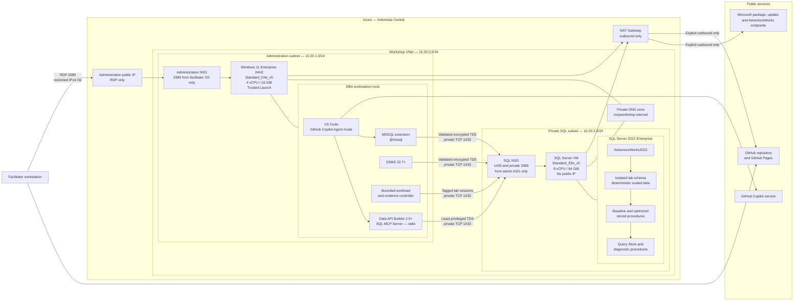
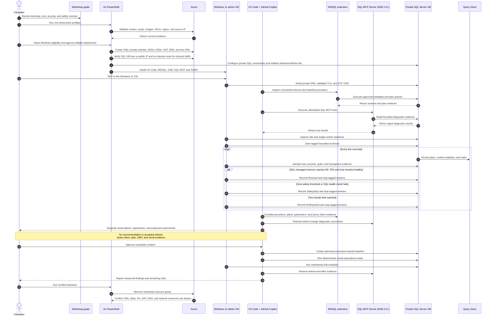
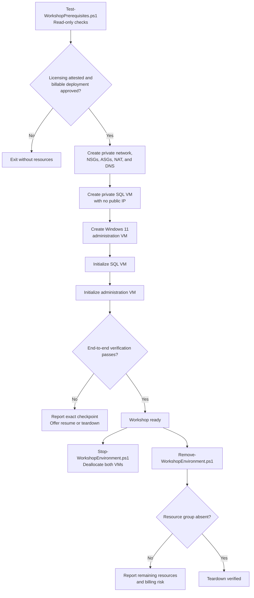

# MCP SQL Query Store Workshop — Design Specification

**Status:** Approved design  
**Date:** 2026-08-31  
**Level:** L400  
**Duration:** Six instructor-led hours, including two ten-minute breaks  
**Repository:** Public GitHub repository `ibranibeny/mcp-sql-query-store-workshop`  
**Publication:** GitHub Pages

## 1. Executive summary

This repository will deliver an evidence-driven L400 workshop for senior SQL Server administrators and performance engineers. It demonstrates how GitHub Copilot, the MSSQL extension for Visual Studio Code, and Microsoft's SQL Model Context Protocol (MCP) Server can assist with understanding and improving a complex stored procedure without replacing DBA judgment.

The workshop uses two Azure virtual machines in Indonesia Central:

1. A Windows 11 Enterprise administration VM runs Visual Studio Code, GitHub Copilot, the MSSQL extension, Data API Builder 2.0 or later, SQL MCP Server, SQL Server Management Studio 22.7 or later, and the bounded workload controller.
2. A private Windows Server 2022 VM runs SQL Server 2022 Enterprise on `Standard_E8s_v5` with 8 vCPU and 64 GiB RAM.

The SQL VM has no public IP. SQL Server accepts encrypted TCP 1433 connections only from the administration VM over the private virtual network. The administration VM alone has an RDP public endpoint, restricted to the facilitator's confirmed IPv4 `/32`. A NAT Gateway supplies explicit outbound-only connectivity for activation, updates, package installation, GitHub, and the AdventureWorks download.

The lab restores `AdventureWorks2022`, creates an isolated `lab` schema with deterministic synthetic data, and runs a bounded, deliberately inefficient month-end reporting procedure. Query Store, execution plans, dynamic management views, and controlled SQL MCP diagnostic tools provide evidence. Participants create an optimized procedure beside the baseline, verify result equivalence, perform an interleaved A/B test, and retain a change only when measured evidence supports it.

The requested 70% memory behavior is an observation target, not a promised result. The lab can set `max server memory` to 45,875 MB, which is 70% of 64 GiB rounded down. It then attempts to bring SQL Server managed memory into a 65–70% band through a bounded workload. Host safety thresholds are measured separately. The controller reports the actual result and stops safely on timeout or threshold breach.

## 2. Confirmed decisions

| Decision | Approved value |
|---|---|
| Azure region | Indonesia Central (`indonesiacentral`) |
| Topology | Separate administration and SQL Server VMs |
| Administration VM | Windows 11 Enterprise 24H2, `Standard_D4s_v5`, 4 vCPU, 16 GiB RAM |
| Administration tools | VS Code, GitHub Copilot, MSSQL extension, DAB SQL MCP Server, SSMS |
| SQL VM | Windows Server 2022, SQL Server 2022 Enterprise, `Standard_E8s_v5`, 8 vCPU, 64 GiB RAM |
| SQL Marketplace coordinates | `MicrosoftSQLServer:SQL2022-WS2022:enterprise-gen2` |
| SQL licensing default | Pay-as-you-go (`PAYG`) |
| Deployment interface | Native Az PowerShell modules |
| Sample database | `AdventureWorks2022.bak` from Microsoft SQL Server samples |
| SQL MCP implementation | SQL MCP Server in Data API Builder 2.0 or later |
| MCP transport | Local `stdio`, managed by VS Code on the administration VM |
| Public ingress | RDP to administration VM only, restricted to facilitator IPv4 `/32` |
| SQL ingress | Private TCP 1433 from administration application security group only |
| SQL public IP | None |
| Outbound connectivity | NAT Gateway on private subnets |
| Workshop duration | Six hours |
| GitHub visibility | Public |
| Repository name | `mcp-sql-query-store-workshop` |
| Published format | Custom static GitHub Pages workshop site |

Read-only Azure validation on 2026-08-31 confirmed that `Standard_D4s_v5`, `Standard_E8s_v5`, Windows 11 Enterprise image SKUs, and the SQL Server 2022 Enterprise image SKU were returned as available in Indonesia Central for the current subscription. Availability and capacity can change; deployment preflight must repeat these checks and resolve an immutable image version before creating resources.

## 3. Goals and non-goals

### 3.1 Goals

1. Explain MCP at the protocol, client, server, transport, tool-discovery, invocation, authorization, and approval boundaries.
2. Explain the distinct roles of GitHub Copilot, MSSQL extension tools, `@mssql`, SQL MCP Server in Data API Builder, and SSMS Agent mode.
3. Deploy a reproducible two-VM lab with native Az PowerShell.
4. Keep SQL Server unreachable from the public internet.
5. Restore AdventureWorks2022 and create an isolated, disposable performance lab.
6. Produce bounded memory pressure through a complex stored procedure under controlled concurrency.
7. Capture Query Store, plan, wait, grant, spill, TempDB, process-memory, and host-memory evidence.
8. Use VS Code and SQL MCP to learn the allowlisted diagnostic model while using MSSQL tools for broader connected-schema and execution-plan analysis.
9. Improve the stored procedure while preserving its parameter and result contract.
10. Prove or reject the improvement with deterministic correctness checks and interleaved A/B measurements.
11. Teach least privilege, human approval, cost control, failure handling, rollback, and verified teardown.
12. Publish the complete workshop, scripts, diagrams, prompt book, and official source references through GitHub Pages.

### 3.2 Non-goals

1. This is not a production high-availability SQL Server architecture.
2. This is not an Azure SQL Database or Azure SQL Managed Instance workshop.
3. This is not an autonomous production tuning system.
4. SQL MCP Server will not be represented as an arbitrary SQL or DDL engine.
5. GitHub Copilot output will not be accepted without database evidence and human review.
6. The workshop will not guarantee exactly 70% memory utilization.
7. The workshop will not expose SQL Server or the SQL VM to the internet.
8. Repository implementation will not create billable Azure resources without a separate deployment approval after preflight.
9. The repository will not publish credentials, private keys, generated secrets, or unreviewed evidence.

## 4. Audience and prerequisites

### 4.1 Audience

The primary audience is experienced SQL Server administrators and performance engineers. Database engineers, senior developers, and platform architects can participate if they understand SQL Server execution fundamentals.

### 4.2 Required knowledge

Participants should understand:

- indexes, statistics, joins, aggregations, and execution plans;
- stored procedures and parameter behavior;
- Query Store fundamentals;
- dynamic management views and wait statistics;
- SQL Server memory grants and TempDB spills;
- PowerShell fundamentals;
- Azure VMs, disks, virtual networks, NSGs, ASGs, and licensing;
- GitHub Copilot Chat and explicit tool approvals.

### 4.3 Facilitator prerequisites

The facilitator requires:

- an Azure subscription with permission to create and remove the specified resources;
- sufficient regional vCPU quota for both VM families;
- a GitHub account with Copilot access;
- GitHub CLI authenticated as `ibranibeny` for publication;
- current Azure PowerShell Az modules;
- a stable public IPv4 address for an RDP `/32` rule;
- confirmation of Windows 11 Enterprise licensing eligibility;
- acceptance of Windows, VM, disk, network, and SQL Server Enterprise PAYG charges;
- separate eligibility confirmation before using Azure Hybrid Benefit.

Windows 11 client images on Azure require an eligible Windows Enterprise, Microsoft 365, Visual Studio dev/test, Windows VDA, or other qualifying entitlement for the intended scenario. Preflight records an explicit facilitator attestation; it does not infer licensing eligibility from Marketplace visibility.

## 5. Accuracy and evidence policy

Every important claim in the workshop carries one of these labels:

| Label | Meaning |
|---|---|
| `DOC-VERIFIED` | Supported by a cited Microsoft Learn or official Microsoft source |
| `SUBSCRIPTION-VALIDATED` | Read-only validation against the current Azure subscription with date and context |
| `LAB-MEASURED` | Populated only from a real workshop execution |
| `ASSUMPTION` | Requires facilitator validation before operational use |

The workshop explicitly separates:

- **Observation:** a value returned by a plan, Query Store, DMV, performance counter, or tool.
- **Hypothesis:** an explanation consistent with current evidence but not yet proven.
- **Proposal:** a candidate change or experiment.
- **Decision:** a retained or rejected change after correctness and performance validation.

No sample benchmark number is described as an actual result. Illustrative output is labeled as illustrative. A target that is not reached is reported as `NotReached`, never replaced with an invented value.

## 6. Technical boundary: MSSQL tools versus SQL MCP Server

### 6.1 MSSQL extension and `@mssql`

The MSSQL extension supplies connected-database context and tools for schema exploration, query execution, execution-plan analysis, and DDL workflows. The `@mssql` participant is the primary surface for broad schema-aware DBA analysis. Inline Copilot completions are not treated as connected-schema-aware.

### 6.2 SQL MCP Server in Data API Builder

Microsoft's SQL MCP Server is included in Data API Builder. The workshop requires DAB 2.0 or later. DAB exposes configured tables, views, and stored procedures through a controlled MCP surface and enforces DAB roles, entity permissions, field permissions, operations, and policies.

The lab enables only an allowlisted, read-only diagnostic surface. Relevant tools include `describe_entities`, `read_records`, `aggregate_records`, `execute_entity`, and named custom tools derived from diagnostic stored procedures. Create, update, and delete tools are disabled globally.

`describe_entities` reads DAB's in-memory configuration. It does not independently reverse-engineer the complete database and depends on configured entity and field descriptions. The workshop will not claim otherwise.

SQL MCP Server is designed around DML and stored-procedure execution, not arbitrary schema modification. DDL remains under direct DBA control through the MSSQL extension or SSMS.

### 6.3 SSMS MCP material

The SSMS module explains the MCP client-server model, Agent mode requirement, disabled-by-default tools, explicit tool enablement, administrative allow lists, and least-privilege safeguards. SSMS is a comparison and fallback surface. The live SQL MCP workflow remains centered on VS Code.

## 7. Architecture



### 7.1 Network design

- VNet: `10.20.0.0/16`.
- Administration subnet: `10.20.1.0/24`.
- SQL subnet: `10.20.2.0/24`.
- Both subnets disable default outbound access and use the NAT Gateway.
- Only the administration VM has an instance-level public IP.
- The SQL VM has a static private IP and a private DNS record such as `sql01.mcpworkshop.internal`.
- Application security groups distinguish administration and SQL NICs.
- The SQL subnet NSG explicitly allows TCP 1433 and private RDP from the administration ASG, then explicitly denies other VNet-initiated inbound traffic before Azure's default `AllowVNetInBound` rule.
- Windows Firewall mirrors the NSG source and port restrictions.
- SQL Browser remains disabled and no UDP 1434 rule is created.
- NSGs are associated at the subnet level only to avoid dual-NSG troubleshooting ambiguity.

### 7.2 Connectivity matrix

| Source | Destination | Port | Result | Purpose |
|---|---|---:|---|---|
| Facilitator IPv4 `/32` | Administration VM public IP | TCP 3389 | Allow | Interactive RDP |
| Any other internet source | Administration VM | Any | Deny | Prevent broad exposure |
| Administration ASG | SQL ASG | TCP 1433 | Allow | VS Code, SQL MCP, SSMS, workload |
| Administration ASG | SQL ASG | TCP 3389 | Allow | Optional private OS administration |
| Other VNet sources | SQL ASG | Any | Deny | Enforce tier boundary |
| Internet | SQL VM | Any | No path and deny | SQL VM has no public IP |
| Both VMs | Internet | TCP 443 through NAT | Allow outbound | Activation, updates, packages, source downloads |

### 7.3 Rationale

The two-VM topology separates the administration and database tiers and demonstrates a realistic private SQL access pattern. It costs more than an all-in-one VM but directly satisfies the selected requirement: VS Code and SQL MCP run on a Windows 11 Azure workstation and connect privately to a dedicated 64-GiB SQL Server VM.

Azure Bastion is the preferred production-style alternative to an exposed RDP endpoint. It is not the default workshop path because it adds cost and setup not required for the core learning objective. The selected RDP endpoint is constrained to the facilitator's exact source address and should be removed with the lab.

## 8. End-to-end demonstration flow



## 9. Six-hour curriculum

| Time | Module | Outcome |
|---:|---|---|
| 15 min | Orientation and safety contract | Understand licensing, cost, destructive actions, stop conditions, and evidence labels |
| 35 min | MCP, SQL MCP Server, and GitHub Copilot | Distinguish model, client, server, transport, tools, MSSQL context, and approvals |
| 25 min | Scenario and two-tier architecture | Trace the trust boundary from Windows 11 tooling to private SQL Server |
| 60 min | Native Az PowerShell deployment | Preflight and deploy the two-VM architecture |
| 10 min | Break | No lab action |
| 65 min | Build and reproduce the problem | Restore AdventureWorks, scale data, enable Query Store, baseline, and create bounded pressure |
| 65 min | Investigate through Visual Studio Code | Explore schema, explain logic, inspect plans, and retrieve allowlisted evidence |
| 10 min | Break | No lab action |
| 55 min | Optimize and prove | Create a candidate, validate equivalence, execute A/B tests, and evaluate metrics |
| 20 min | Teardown and review | Remove Azure resources, verify absence, and discuss production controls |
| **360 min** | **Total** | **Six hours** |

Lunch is outside the six-hour agenda.

### 9.1 Learning objectives

By the end of the workshop, participants can:

1. trace an MCP tool call from GitHub Copilot through client, server, authorization, SQL Server, and result;
2. explain why SQL MCP Server and the MSSQL extension are complementary;
3. configure a least-privileged SQL MCP diagnostic surface;
4. explain the private network path and prove that SQL Server is not public;
5. distinguish host memory, SQL process memory, Total Server Memory, Target Server Memory, buffer cache, and workspace grants;
6. interpret Query Store runtime, plan, and wait evidence for a stored procedure;
7. identify non-SARGable predicates, oversized intermediate rows, inefficient aggregates and sorts, spills, and parameter sensitivity;
8. challenge unsupported AI conclusions and demand reproducible evidence;
9. validate an optimized procedure without overwriting the baseline;
10. use Query Store hints only as optional, reversible mitigation after foundational tuning;
11. stop, rollback, deallocate, and remove the lab safely.

## 10. Scenario and stored-procedure contract

### 10.1 Business scenario

Adventure Works has a month-end sales analysis procedure that summarizes sales by territory, customer, and product for a requested date range. Under month-end concurrency, execution slows, SQL managed memory approaches its configured ceiling, some requests receive excessive grants, other requests wait, and selected parameter sets spill to TempDB.

The DBA must determine:

- the business result and contract;
- which operators and parameter distributions drive memory behavior;
- whether the pressure comes from data cache, query execution grants, spills, or a combination;
- whether the query can be improved without changing its output;
- whether a Query Store hint is justified as a temporary mitigation;
- what measured evidence proves or rejects the candidate.

### 10.2 Procedure contract

The baseline and optimized procedures accept identical parameters:

- start date;
- exclusive end date;
- optional sales territory;
- requested top-result count.

They return identical ordered columns, data types, null semantics, row identities, aggregate values, and documented ordering. Names differ so they can be tested side by side.

### 10.3 Synthetic data

AdventureWorks2022 source objects remain unchanged. Setup creates a `lab` schema containing deterministic synthetic fact data derived from AdventureWorks keys. Generation uses fixed seeds, bounded batches, explicit maximum rows, a maximum database-size threshold, free-space checks, and progress reporting.

The default target is a 24–32 GiB lab data footprint on the dedicated data disk. Setup computes the estimated footprint and refuses to start unless enough capacity remains for data, indexes, growth, Query Store, TempDB activity, and recovery. The exact row count is determined by measured average row size rather than a hard-coded claim.

Synthetic data exists only to create repeatable plan shapes, scans, caching, sorts, hashes, and concurrency. It is not a production benchmark.

### 10.4 Deliberate baseline anti-patterns

`lab.usp_MonthEndSalesBaseline` contains a controlled combination of:

- a non-SARGable date predicate;
- a wide intermediate row payload;
- filtering later than necessary;
- repeated access to the same fact data;
- late aggregation;
- memory-intensive hash and sort operators;
- parameter distributions that exercise different cardinalities;
- bounded concurrency sufficient to expose grant pressure.

It must not use an unbounded Cartesian product or destructive global cache commands.

### 10.5 Candidate themes

`lab.usp_MonthEndSalesOptimized` is created beside the baseline. Candidate changes may include:

- SARGable half-open date ranges;
- early selective filtering;
- narrower projections before joins and sorts;
- pre-aggregation at the correct grain;
- removal of duplicate fact access;
- evidence-supported indexes and statistics maintenance;
- parameter-sensitive mitigation supported by captured parameter behavior;
- a conservative Query Store hint as a separate optional exercise.

The repository includes a reference candidate for reproducibility, but the instructional workflow requires participants to derive and validate the categories of change from evidence.

## 11. Memory target and safety model

### 11.1 Definition of 70%

The selected SQL VM has 64 GiB RAM:

$$
64 \times 1024 \times 0.70 = 45{,}875.2\ \text{MiB}
$$

The lab rounds down to `45,875 MB` for `max server memory`. This is a ceiling for memory governed by that setting; it is not an allocation command and does not cap every allocation visible in `sqlservr.exe`.

The primary observation target is SQL Server **Total Server Memory divided by host physical memory**, sustained between 65% and 70% for three consecutive five-second samples. Host physical-memory use is a separate safety signal and will normally be higher because Windows and processes outside the SQL memory manager also consume RAM.

`min server memory` remains `0`. The workshop does not set minimum and maximum memory to the same or nearly the same value.

### 11.2 Required measurements

| Measurement | Evidence source | Interpretation |
|---|---|---|
| Host total, used, and available memory | `sys.dm_os_sys_memory` plus a Windows counter cross-check | Host safety and denominator validation |
| SQL process physical memory | `sys.dm_os_process_memory` | Whole `sqlservr.exe` consumption |
| Total and Target Server Memory | SQL Server performance counter DMV | Current committed and target managed memory |
| Buffer pool by database | DMVs | Cached database pages versus other consumers |
| Granted Workspace Memory | SQL Server performance counter DMV | Active query-execution grants |
| Memory Grants Outstanding and Pending | SQL Server performance counter DMV | Grant activity and contention |
| Resource semaphore totals and waiters | `sys.dm_exec_query_resource_semaphores` | Grant-pool pressure |
| Active query grants | `sys.dm_exec_query_memory_grants` | Requested, granted, used, and waiting memory by session |
| Spill and TempDB evidence | Actual plans, Query Store, TempDB DMVs | Grants that are insufficient |
| Query Store runtime and waits | Query Store catalog views | Persistent before-and-after evidence |

### 11.3 Adaptive controller

1. Refuse to run unless the expected server, Enterprise edition, database, and workshop marker are present.
2. Verify Query Store is `READ_WRITE`.
3. Verify host physical memory and `max server memory` match the approved lab profile.
4. Capture idle and single-execution baselines.
5. Start one worker tagged with a unique application name and session context.
6. Sample evidence every five seconds.
7. Add at most one worker every twenty seconds while SQL managed memory is below 65%, host available memory exceeds 12 GiB, and all health checks pass.
8. Never exceed four concurrent workers.
9. Declare `Reached` after three consecutive samples show SQL managed memory between 65% and 70% of host physical memory.
10. Stop all tagged workers and capture final evidence on success, timeout, manual stop, SQL health failure, or safety breach.

### 11.4 Hard guardrails

The controller stops the tagged workload when any condition occurs:

- host used physical memory exceeds 87.5%;
- host available memory falls below 8 GiB;
- SQL process or virtual memory reports low-memory state;
- SQL health checks fail twice consecutively;
- workload duration reaches ten minutes;
- a manual stop flag is set;
- the workshop identity marker disappears;
- a worker exceeds its command timeout.

Cancellation kills only sessions carrying both the workshop application name and session-context marker. It never performs a broad kill.

Prohibited operations include:

- `DBCC DROPCLEANBUFFERS`;
- global `DBCC FREEPROCCACHE`;
- an unbounded cross join;
- disabling Windows memory safeguards;
- setting `min server memory` to the target;
- opening TCP 1433 publicly;
- adding a public IP to the SQL VM;
- running against a database without the lab marker.

### 11.5 Outcome states

| State | Meaning |
|---|---|
| `Reached` | Three consecutive samples placed SQL managed memory in the 65–70% band |
| `NotReached` | The bounded run completed or timed out below the band |
| `SafetyStop` | A safety threshold stopped the workload |
| `ManualStop` | The facilitator requested cancellation |
| `Failed` | Identity, setup, measurement, or workload execution was invalid |

## 12. Evidence-driven Copilot workflow

Copilot responses in the lab must use these sections:

1. Observations
2. Missing evidence
3. Hypotheses ranked by confidence
4. Proposed experiments
5. Candidate changes
6. Risks and rollback
7. Validation criteria

The workflow is:

1. Connect the MSSQL extension from the Windows 11 VM to the private SQL DNS name.
2. Use `@mssql` to inspect actual schema and stored-procedure definitions.
3. Generate and attach actual execution plans for representative parameter sets.
4. Use SQL MCP `describe_entities` to inspect only the configured diagnostic contract.
5. Invoke allowlisted tools for current memory, Query Store top queries, Query Store waits, memory grants, plan summaries, and run comparisons.
6. Ask Copilot to distinguish observations from hypotheses.
7. Reject recommendations that cannot identify an evidence source.
8. Create the candidate procedure beside the baseline after explicit approval.
9. Verify result equivalence before performance testing.
10. Run interleaved A/B trials to reduce ordering and cache bias.
11. Compare median and P95 duration, CPU, logical reads, grant size, spill size, waits, and throughput.
12. Retain or reject the candidate and record the reason.

## 13. Correctness and performance validation

### 13.1 Correctness matrix

The matrix covers:

- narrow and broad date ranges;
- null territory and specific territories;
- low-, medium-, and high-cardinality parameters;
- minimum and maximum supported top-result values;
- no-match ranges;
- boundary dates;
- repeated executions.

Each baseline/candidate pair must pass:

- result schema and data-type comparison;
- row-count comparison;
- deterministic result hashing where appropriate;
- baseline `EXCEPT` candidate;
- candidate `EXCEPT` baseline;
- ordering checks where ordering is contractual;
- parameter validation and error behavior.

### 13.2 Performance protocol

- Preserve Query Store evidence by run label and time window.
- Separate warm-up iterations from measured iterations.
- Interleave baseline and candidate executions.
- Use identical parameter matrices and concurrency profiles.
- Record median and P95 duration, CPU time, logical reads, grant size, used grant, spills, waits, and completed requests.
- Record worker count, memory configuration, database size, Query Store state, VM SKU, and image version.
- Do not claim improvement from a single execution.

The candidate is accepted only when every correctness check passes, at least two primary performance measures improve, and no material regression appears in another primary measure.

### 13.3 Optional Query Store hint exercise

A separate mitigation exercise may apply a conservative Query Store hint such as a memory-grant cap or recompilation only when evidence supports it. Participants inspect hint status and failure details, repeat the measurement, clear the hint, and verify removal. The workshop states that hints are a last resort and that statistics, indexes, compatibility level, and query design should be evaluated first.

## 14. Security design

### 14.1 Azure controls

- The SQL VM has no public IP.
- The SQL subnet accepts TCP 1433 only from the administration ASG.
- The SQL subnet accepts TCP 3389 only from the administration ASG for optional private administration.
- Other VNet-initiated SQL subnet traffic is explicitly denied before default NSG rules.
- The administration public IP allows RDP only from a confirmed facilitator `/32`.
- The script never falls back to `0.0.0.0/0`.
- NAT Gateway provides outbound connectivity without an inbound path.
- Managed disks use Azure Storage Service Encryption by default.
- Both VMs use Trusted Launch when the chosen images and sizes support it.

### 14.2 TDS encryption

Bootstrap creates a lab-only certificate for the private SQL DNS name, configures SQL Server to use it, installs only the public trust certificate on the administration VM, and restarts SQL Server at the documented checkpoint. The private key remains non-exportable on the SQL VM.

All client profiles require encryption and certificate validation. Readiness verification checks `encrypt_option = TRUE` from the remote administration VM. A fallback using `TrustServerCertificate=True` is documented only as a troubleshooting exception and is not the successful lab path.

### 14.3 Identity and secrets

- VM administrator credentials are collected as PowerShell credential objects.
- No default password is embedded.
- SQL administrative and SQL MCP logins are separate.
- The SQL MCP login is least privileged.
- The DAB connection string is stored in an ignored `.env` file on the administration VM with a restrictive ACL.
- `.env.example` contains no secret.
- GitHub Copilot authentication is interactive on the administration VM.
- Generated evidence remains ignored until reviewed and redacted.

### 14.4 SQL permissions

The SQL MCP login receives only:

- `CONNECT` to AdventureWorks2022;
- `SELECT` on explicitly allowlisted diagnostic views;
- `EXECUTE` on explicitly allowlisted diagnostic procedures;
- no direct write permission on AdventureWorks or `lab` base tables;
- no DDL permission;
- no server administrative role.

Diagnostic procedures return bounded result sets and reject unsafe ranges. Module signing or ownership chaining avoids broad DMV permissions where practical.

### 14.5 MCP controls

- DAB disables create, update, and delete tools globally.
- Only documented diagnostic entities participate in MCP.
- Sensitive and administrative objects are excluded.
- Entity and field descriptions are complete.
- Tool calls remain subject to VS Code approval.
- Workload start, stop, session termination, DDL, and server configuration are not exposed through SQL MCP.

## 15. Azure deployment design

### 15.1 Resources

The resource group contains:

- one Windows 11 Enterprise administration VM, `Standard_D4s_v5`;
- one SQL Server 2022 Enterprise VM, `Standard_E8s_v5`;
- one static Standard public IP for administration RDP;
- one static Standard public IP for NAT Gateway outbound use;
- one NAT Gateway;
- one VNet with administration and SQL private subnets;
- two subnet-level NSGs;
- administration and SQL application security groups;
- one private DNS zone and SQL A record;
- managed NICs and disks;
- SQL IaaS Agent extension registration;
- auto-shutdown schedules and consistent tags.

The initial disk profile is:

| VM | Disk | Proposed size and type | Purpose |
|---|---|---|---|
| Administration | OS | 128 GiB Premium SSD | Windows 11 and tools |
| SQL | OS | 128 GiB Premium SSD | Windows Server and SQL binaries |
| SQL | Data | 256 GiB Premium SSD | AdventureWorks, synthetic data, Query Store |
| SQL | Log | 128 GiB Premium SSD | Transaction log |

TempDB uses validated local temporary storage when supported and persistent-data risk is explicitly understood. Otherwise, bootstrap places TempDB on a designated managed volume and records the deviation.

### 15.2 Image resolution

Preflight locates:

- publisher `MicrosoftWindowsDesktop`, offer `windows-11`, preferred SKU `win11-24h2-ent`;
- publisher `MicrosoftSQLServer`, offer `SQL2022-WS2022`, SKU `enterprise-gen2`.

It resolves `latest` to exact versions, records those versions in the deployment evidence, and deploys the immutable versions rather than leaving the run unpinned.

### 15.3 Deployment lifecycle



### 15.4 Preflight gates

Preflight is non-destructive and validates:

- PowerShell edition and required Az module versions;
- authenticated Azure account, tenant, and selected subscription;
- provider registration state;
- Indonesia Central availability;
- both VM SKUs and current restrictions;
- both image coordinates and exact versions;
- regional quota for both VM families;
- Windows 11 licensing attestation;
- SQL Enterprise PAYG or validated Azure Hybrid Benefit choice;
- source public IPv4 `/32`;
- resource-name conflicts;
- required disk and network SKU availability;
- estimated billable resource categories;
- absence of an existing resource group unless resume mode is explicit.

If a required validation cannot run, deployment stops. It does not silently change region, image, SKU, license, or source range.

### 15.5 SQL VM bootstrap

Bootstrap will:

1. verify SQL Server edition, version, and service state;
2. configure and verify private-only SQL connectivity;
3. configure validated TDS encryption for the private DNS name;
4. configure data and log storage with 64-KiB allocation units;
5. download `AdventureWorks2022.bak` through NAT from the official release;
6. run `RESTORE VERIFYONLY` before restore;
7. restore with explicit data and log paths;
8. configure `max server memory`, retaining the previous value in evidence;
9. create the lab marker, schema, data, procedures, diagnostics, and least-privileged MCP login;
10. enable and verify Query Store `READ_WRITE` state;
11. verify no public IP and no broad NSG or Windows Firewall rule;
12. emit a machine-readable readiness report.

### 15.6 Administration VM bootstrap

Bootstrap will:

1. verify Windows 11 edition, activation state, Trusted Launch, secure boot, and vTPM;
2. install VS Code, MSSQL extension, GitHub Copilot extensions, SSMS 22.7 or later, .NET 9 or later, DAB 2.0 or later, Git, GitHub CLI, and required PowerShell modules from official sources;
3. clone the workshop repository;
4. install the SQL server public trust certificate;
5. create encrypted MSSQL and DAB connection configuration without committing secrets;
6. validate private DNS and SQL TCP connectivity;
7. connect remotely and verify TDS certificate validation;
8. create an ignored DAB `.env` file with restrictive ACL;
9. start SQL MCP over `stdio` and enumerate the expected allowlisted tools;
10. emit a machine-readable readiness report.

Every setup step has a positive read-back. A command that reports success without a successful read-back is treated as failed.

### 15.7 Cost controls

- PAYG is the default SQL license mode.
- Azure Hybrid Benefit is used only after eligibility attestation.
- Windows 11 eligibility is attested separately.
- Preflight lists all billable resource categories and any live price retrieval assumptions.
- Both VMs receive auto-shutdown schedules.
- The guide instructs deallocation between sessions.
- Teardown removes the resource group and then queries Azure to prove absence.
- No price is hard-coded as current; estimates include date, currency, region, and assumptions.

## 16. Repository design

```text
mcp-sql-query-store-workshop/
├── README.md
├── LICENSE
├── SECURITY.md
├── .gitignore
├── index.html
├── .github/
│   ├── copilot-instructions.md
│   └── workflows/validate.yml
├── .vscode/
│   ├── extensions.json
│   └── mcp.json
├── docs/
│   ├── facilitator-guide.md
│   ├── attendee-guide.md
│   ├── troubleshooting.md
│   ├── evidence-and-sources.md
│   └── superpowers/specs/
├── workshop/
│   ├── 00-orientation.md
│   ├── 01-mcp-and-copilot.md
│   ├── 02-scenario-and-architecture.md
│   ├── 03-deploy-with-powershell.md
│   ├── 04-create-memory-pressure.md
│   ├── 05-investigate-with-vscode.md
│   ├── 06-optimize-and-prove.md
│   └── 07-teardown.md
├── deploy/
│   ├── Test-WorkshopPrerequisites.ps1
│   ├── Deploy-WorkshopEnvironment.ps1
│   ├── Initialize-SqlVm.ps1
│   ├── Initialize-AdminVm.ps1
│   ├── Stop-WorkshopEnvironment.ps1
│   └── Remove-WorkshopEnvironment.ps1
├── sql/
│   ├── 00-preflight.sql
│   ├── 01-configure-instance.sql
│   ├── 02-restore-and-configure-database.sql
│   ├── 03-create-scaled-lab-data.sql
│   ├── 04-create-baseline-procedure.sql
│   ├── 05-create-diagnostics.sql
│   ├── 06-create-optimized-procedure.sql
│   ├── 07-validate-equivalence.sql
│   └── 08-cleanup.sql
├── workload/
│   ├── Start-MemoryPressureLab.ps1
│   ├── Stop-MemoryPressureLab.ps1
│   └── Export-WorkshopEvidence.ps1
├── mcp/
│   ├── dab-config.json
│   ├── .env.example
│   └── README.md
├── prompts/
│   ├── investigation-prompts.md
│   └── prompt-evaluation-rubric.md
├── evidence/
│   ├── README.md
│   └── evidence-template.json
├── web/
│   ├── build-site.py
│   ├── styles.css
│   └── app.js
└── site/
    └── assets/
```

The root `index.html` is the generated GitHub Pages entry point. Source Markdown, scripts, configuration, and build assets stay in the repository. Runtime `.env` files and generated evidence are ignored.

## 17. SQL MCP configuration design

### 17.1 Runtime

- DAB 2.0 or later is installed as a local .NET tool on the administration VM.
- VS Code launches DAB through `.vscode/mcp.json` using `stdio` and `dab start --mcp-stdio`.
- The DAB role is explicitly set to the workshop read-only role.
- Logging does not write protocol-breaking output to standard output.
- The encrypted connection string is read from the ignored environment file.

### 17.2 Exposed diagnostic entities

The allowlist contains bounded equivalents of:

- workshop run summaries;
- current memory snapshot;
- Query Store top resource consumers;
- Query Store wait summaries;
- stored-procedure plan summary;
- active workshop memory grants;
- baseline-versus-candidate comparison.

Named custom tools use clear descriptions and bounded parameters. Entity and field metadata is complete so the model does not guess names.

### 17.3 Explicitly excluded capabilities

- record creation, update, and deletion;
- arbitrary table exposure;
- arbitrary SQL execution through SQL MCP;
- DDL;
- server configuration changes;
- workload start and stop;
- session termination.

These remain explicit facilitator actions outside the MCP read-only boundary.

## 18. GitHub Pages experience

The site uses a “query-plan workbench” visual language rather than a generic documentation template.

### 18.1 Visual system

- deep blue-black SQL workbench canvas;
- cyan for measured evidence;
- amber for unverified hypotheses;
- red only for safety stops and destructive warnings;
- neutral high-contrast panels for long-form reading;
- execution-plan-shaped module navigation;
- a utility typeface for metrics and T-SQL plus a readable technical body typeface;
- a signature evidence path that changes a claim from hypothesis to measured decision.

### 18.2 Functional requirements

- responsive desktop and tablet layouts with usable mobile reading;
- keyboard navigation, visible focus, and reduced-motion support;
- print styles for facilitator and attendee guides;
- copy controls for PowerShell, T-SQL, JSON, and prompts;
- Mermaid architecture, sequence, deployment, and safety diagrams;
- browser-local progress only;
- a memory calculator explaining configured ceiling versus observed utilization;
- source links adjacent to technically sensitive claims;
- explicit destructive and billable action labels;
- no analytics or external data collection by default.

## 19. Error handling and recovery

| Failure | Required behavior |
|---|---|
| Azure authentication unavailable | Stop preflight and show the exact authentication requirement |
| Wrong tenant or subscription | Stop and require explicit context selection |
| SKU, image, or region unavailable | Stop; do not silently substitute |
| Insufficient quota | Report required, available, and missing vCPUs; create nothing |
| Windows 11 licensing not attested | Create nothing |
| SQL Enterprise licensing not acknowledged | Create nothing |
| Source IP unresolved | Require explicit IPv4 `/32`; never use a broad RDP source |
| Azure Policy blocks a resource | Report policy evidence; do not weaken policy automatically |
| Partial deployment | Report last verified checkpoint and offer resume or full teardown |
| SQL VM has a public IP | Fail verification and remove or detach it before continuing |
| Broad SQL NSG or firewall rule exists | Fail verification and do not start the lab |
| TDS certificate validation fails | Stop; do not silently enable trust-server-certificate mode |
| Backup verification fails | Do not restore or continue setup |
| Query Store not `READ_WRITE` | Do not start workload |
| Data-disk headroom insufficient | Stop generation before unsafe consumption |
| Memory target not reached | Record `NotReached`; do not exceed approved limits |
| Safety threshold crossed | Capture evidence, stop only tagged workers, record `SafetyStop` |
| Candidate correctness mismatch | Reject candidate and skip performance acceptance |
| DAB fails to start | Show MCP output, version, configuration, environment, and TLS checks |
| MCP metadata missing | Fail configuration validation before publication |
| Repository already exists | Stop publication and require deliberate reuse or rename |
| Pages enablement fails | Preserve repository, report exact failure, and do not claim a live site |
| Resource-group deletion incomplete | Report remaining resources and billing risk |

## 20. Verification and quality gates

### 20.1 Static validation

- Parse PowerShell with the abstract syntax tree parser.
- Run PSScriptAnalyzer with repository rules.
- Validate JSON, DAB, and MCP configuration.
- Validate Markdown links and anchors.
- Validate Mermaid blocks.
- Scan tracked files for secret-like values and forbidden `.env` content.
- Verify generated evidence paths are ignored.
- Verify prohibited SQL commands are absent from workload scripts.
- Verify loops, data generation, diagnostics, and outputs are bounded.

### 20.2 Pester tests

Tests cover:

- parameter validation;
- no-deploy behavior on preflight failure;
- exact `/32` RDP rule creation;
- absence of public SQL rules and SQL public IP;
- ASG-scoped private SQL rule construction;
- SKU, image, quota, and licensing result handling;
- immutable image resolution;
- explicit deployment confirmation;
- idempotent resource discovery;
- teardown confirmation and absence checks;
- workload state transitions using mocked memory samples.

### 20.3 SQL tests

On a real lab deployment, tests cover:

- edition, version, memory configuration, lab marker, and Query Store state;
- idempotent lab creation;
- bounded data generation and free-space checks;
- diagnostic permission boundaries;
- denial of writes and DDL to the MCP login;
- baseline/candidate result equivalence;
- session tagging and precise cancellation;
- workload outcome and evidence completeness;
- Query Store hint set, inspect, clear, and verify cycle.

### 20.4 Network and client tests

- Prove the SQL NIC has no public IP association.
- Prove no NSG permits public TCP 1433 or UDP 1434.
- Prove administration-to-SQL TCP 1433 succeeds privately.
- Prove the returned SQL connection is encrypted with certificate validation.
- Prove DAB exposes only expected tools and entities.
- Prove both subnets have explicit NAT outbound connectivity.
- Prove Windows 11 client requirements and activation state.

### 20.5 Site and publication tests

- Build the static site from source.
- Validate structure and internal navigation.
- Check responsive layout at representative widths.
- Run keyboard and accessibility checks.
- Confirm reduced-motion behavior.
- Verify copy controls and Mermaid rendering.
- Verify the public repository URL.
- Verify the GitHub Pages endpoint returns the workshop before reporting success.

## 21. Publication workflow

1. Build and validate the root GitHub Pages entry point.
2. Confirm GitHub CLI is authenticated as `ibranibeny`.
3. Confirm `ibranibeny/mcp-sql-query-store-workshop` does not already exist.
4. Create the public repository from the complete local workspace.
5. Push `main`.
6. Enable GitHub Pages from the repository root on `main`.
7. Read back the Pages configuration and deployment status.
8. Verify the live URL before claiming publication success.
9. Return repository and live-site URLs.

Publication preserves the full source repository. It does not publish only a generated HTML file.

## 22. Official source baseline

Implementation will cite and revalidate these primary sources:

- [Use MCP servers with GitHub Copilot in SQL Server Management Studio](https://learn.microsoft.com/en-us/ssms/github-copilot/mcp-servers)
- [What is SQL MCP Server?](https://learn.microsoft.com/en-us/azure/data-api-builder/mcp/overview)
- [Quickstart: Use SQL MCP Server with Visual Studio Code locally](https://learn.microsoft.com/en-us/azure/data-api-builder/mcp/quickstart-visual-studio-code)
- [Data manipulation language tools in SQL MCP Server](https://learn.microsoft.com/en-us/azure/data-api-builder/mcp/data-manipulation-language-tools)
- [GitHub Copilot for MSSQL extension for Visual Studio Code](https://learn.microsoft.com/en-us/sql/tools/visual-studio-code-extensions/github-copilot/overview?view=sql-server-ver17)
- [Query optimizer assistant](https://learn.microsoft.com/en-us/sql/tools/visual-studio-code-extensions/github-copilot/query-optimizer-assistant?view=sql-server-ver17)
- [Business logic explainer](https://learn.microsoft.com/en-us/sql/tools/visual-studio-code-extensions/github-copilot/business-logic-explainer?view=sql-server-ver17)
- [Monitor performance by using Query Store](https://learn.microsoft.com/en-us/sql/relational-databases/performance/monitoring-performance-by-using-the-query-store?view=sql-server-ver17)
- [Query Store hints](https://learn.microsoft.com/en-us/sql/relational-databases/performance/query-store-hints?view=sql-server-ver17)
- [Troubleshoot memory grant issues](https://learn.microsoft.com/en-us/troubleshoot/sql/database-engine/performance/troubleshoot-memory-grant-issues)
- [Server memory configuration options](https://learn.microsoft.com/en-us/sql/database-engine/configure-windows/server-memory-server-configuration-options?view=sql-server-ver17)
- [Guide to creating SQL Server VM with PowerShell](https://learn.microsoft.com/en-us/azure/azure-sql/virtual-machines/windows/create-sql-vm-powershell?view=azuresql)
- [SQL Server on Azure VMs security considerations](https://learn.microsoft.com/en-us/azure/azure-sql/virtual-machines/windows/security-considerations-best-practices?view=azuresql)
- [Use Windows client in Azure for dev/test](https://learn.microsoft.com/en-us/azure/virtual-machines/windows/client-images)
- [Deploy Windows 11 on Azure](https://learn.microsoft.com/en-us/azure/virtual-machines/windows/windows-desktop-multitenant-hosting-deployment)
- [Default outbound access in Azure](https://learn.microsoft.com/en-us/azure/virtual-network/ip-services/default-outbound-access)
- [Design virtual networks with Azure NAT Gateway](https://learn.microsoft.com/en-us/azure/nat-gateway/nat-gateway-design)
- [Application security groups](https://learn.microsoft.com/en-us/azure/virtual-network/application-security-groups)
- [AdventureWorks sample databases](https://learn.microsoft.com/en-us/sql/samples/adventureworks-install-configure?view=sql-server-ver17)
- [AdventureWorks release assets](https://github.com/microsoft/sql-server-samples/releases/tag/adventureworks)

Behavior and availability observed on 2026-08-31 can evolve. The workshop states minimum versions and verification dates rather than implying that MCP, Marketplace, or preview behavior is permanent.

## 23. Implementation phases

After written-spec approval, implementation planning will decompose work into these dependency-ordered phases:

1. repository foundation and validation harness;
2. static workshop site and documentation structure;
3. Azure PowerShell preflight, private network, two-VM deployment, stop, and teardown;
4. SQL VM bootstrap, private TLS, and AdventureWorks restore;
5. Windows 11 administration VM bootstrap and toolchain;
6. isolated data scaling, baseline procedure, diagnostics, and Query Store;
7. memory safety controller and evidence export;
8. optimized procedure and correctness/performance harness;
9. DAB SQL MCP configuration and VS Code integration;
10. facilitator guide, attendee labs, prompts, troubleshooting, and citations;
11. full validation, code review, public GitHub publication, and live Pages verification.

Actual Azure resource creation is excluded from repository implementation unless the user separately approves the billable deployment after reviewing its preflight plan card.
