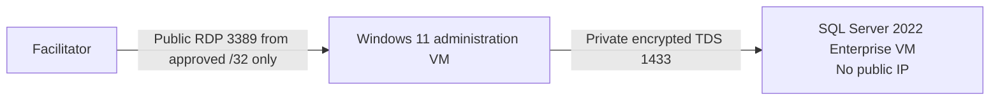

# Orientation and safety contract

**Instruction: 15 minutes · Workshop elapsed: 15 minutes**

## Primary workshop goal

Use **GitHub Copilot**, grounded by **Microsoft SQL MCP** and verified SQL Server evidence, to help a DBA optimize a complex stored procedure while preserving its result contract. Copilot proposes and explains; the DBA validates, measures, and decides.

[!DOC-VERIFIED] [SQL MCP Server](https://learn.microsoft.com/azure/data-api-builder/mcp/overview) exposes configured database entities through Data API Builder permissions, while [SQL Server Database Engine permissions](https://learn.microsoft.com/sql/relational-databases/security/authentication-access/getting-started-with-database-engine-permissions) continue to authorize database actions. This controlled tool boundary is not permission to bypass database authorization or human review.

## Architecture and public ingress boundary

Only the Windows 11 administration VM has public ingress. Its RDP endpoint is restricted to the facilitator's confirmed IPv4 `/32`. The SQL VM has **no public IP** and accepts SQL traffic from the administration tier over the private virtual network only.

[!ASSUMPTION] The facilitator must validate the current source IPv4 address, Windows 11 licensing eligibility, regional capacity, and workshop configuration during preflight.

## Measurement target, not a result

[!TARGET] Under unchanged data, parameters, concurrency, SQL memory configuration, and Resource Governor pool configuration, move workshop-pool query-execution grant utilization from an approximately **80% baseline** (75–85% target band) toward approximately **40% optimized** (35–45% target band).

This is a **target**, not a measured result. It is not a claim about Task Manager, total host memory, SQL Server process memory, Total Server Memory, or buffer-pool usage. Only evidence captured from a real lab run may carry `[!LAB-MEASURED]`. If the target is missed, report the observed outcome; never substitute the target values.

## Safety contract

- **Do not run the workshop workload scripts against production.**
- Use only the disposable, marked workshop environment.
- Keep the SQL VM private; never add a public IP or broad SQL ingress rule.
- Treat Copilot output as a hypothesis or proposal until correctness and performance evidence supports it.
- Stop when a timeout, safety threshold, unexpected object, or unapproved cost boundary is encountered.
- Azure deployment is a separate billable action. Repository build and test commands create no Azure resources.

### Licensing and cost attestations

Before Azure creation, the facilitator must separately attest eligibility to run the Windows 11 Enterprise client image, acknowledge SQL Server 2022 Enterprise PAYG cost, and acknowledge every billable resource category. Azure Hybrid Benefit is not assumed. Marketplace visibility does not prove license eligibility.

The deployment plan card lists the Windows and SQL VMs, managed disks, NAT Gateway, and public IP resources. Stop and ask the subscription owner if any category is unexpected. A failed or incomplete preflight means **no deployment**.

### Operational stop conditions

Stop only the tagged workshop workload when host used memory exceeds 87.5%, host available memory falls below 8 GiB, a SQL low-memory signal appears, SQL health fails twice, the lab marker disappears, a worker times out, the manual stop is requested, or the global ten-minute deadline is reached. Do not respond by increasing pressure or weakening safeguards.

[!DOC-VERIFIED] The SQL MCP and SQL Server authorization claims above link to their official Microsoft Learn sources.

[!ASSUMPTION] Subscription-specific availability must be revalidated by the deployment preflight at the time of use.

## Evidence language

| Label | Use |
|---|---|
| `DOC-VERIFIED` | Backed by a cited official Microsoft source. |
| `SUBSCRIPTION-VALIDATED` | Confirmed read-only against a named subscription context and date. |
| `LAB-MEASURED` | Captured from an actual workshop run. |
| `ASSUMPTION` | Requires facilitator validation before use. |
| `TARGET` | Desired outcome; never presented as an observed result. |

## Before continuing

- State the primary goal in one sentence without saying that Copilot makes the decision.
- Identify the exact 80% → 40% denominator: the workshop pool's regular query-workspace semaphore.
- Confirm production use is prohibited and name the manual stop script.
- Confirm that `SUBSCRIPTION-VALIDATED` expires as capacity, policy, quota, and image availability change.

