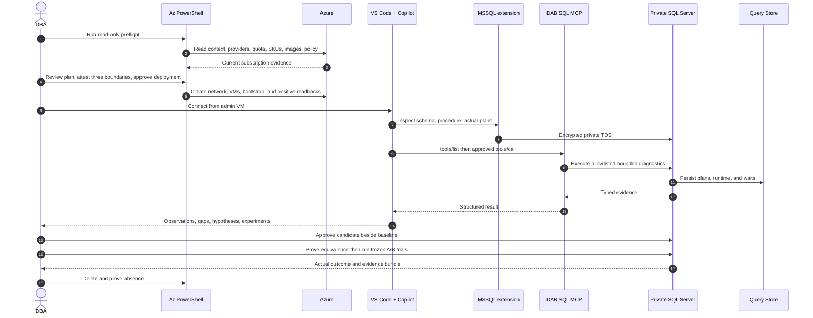

# Scenario and two-tier architecture

**Instruction: 25 minutes · Workshop elapsed: 75 minutes**

Adventure Works has a month-end sales procedure whose wide, late, repeated processing can consume a large share of an isolated query-workspace pool. The team needs a contract-equivalent candidate and evidence that survives skeptical review.

## Two-VM trust boundary

```mermaid
flowchart LR
  U["Facilitator workstation"]:::ext -->|"TCP 3389, source IPv4 /32"| P["Admin public IP"]:::pub
  P --> AN["Admin NSG + ASG"]:::net
  AN --> A["Windows 11 Enterprise admin VM<br/>VS Code, SSMS, GitHub Copilot, DAB SQL MCP"]:::admin
  A -->|"Private DNS + validated TLS, TCP 1433"| SN["SQL NSG + ASG"]:::net
  SN --> S["SQL Server 2022 Enterprise VM<br/>10.20.2.10, no public IP"]:::sql
  S --> QS["Query Store<br/>plans, runtime, waits"]:::data
  A --> NAT["NAT Gateway"]:::net
  S --> NAT
  NAT --> I["Outbound package and source endpoints"]:::ext
  classDef ext fill:#fde68a,stroke:#b45309,color:#3f2d00
  classDef pub fill:#fecaca,stroke:#b91c1c,color:#450a0a
  classDef admin fill:#bfdbfe,stroke:#1d4ed8,color:#0b1f4d
  classDef mcp fill:#ddd6fe,stroke:#6d28d9,color:#2e1065
  classDef sql fill:#bbf7d0,stroke:#15803d,color:#052e16
  classDef data fill:#dcfce7,stroke:#16a34a,color:#052e16
  classDef net fill:#cffafe,stroke:#0e7490,color:#083344
```

The VNet is `10.20.0.0/16`; admin and SQL subnets are `10.20.1.0/24` and `10.20.2.0/24`. **The SQL VM has no public IP.** The admin VM is the only public ingress point, restricted to TCP 3389 from one facilitator IPv4 `/32`. The SQL NSG permits private TCP 1433 and private RDP only from the admin ASG, then denies other VNet-initiated SQL-tier traffic. No UDP 1434 rule exists. Both subnets disable default outbound access and use NAT Gateway for outbound-only connectivity. [!DOC-VERIFIED] See [default outbound access](https://learn.microsoft.com/en-us/azure/virtual-network/ip-services/default-outbound-access), [NAT Gateway design](https://learn.microsoft.com/en-us/azure/nat-gateway/nat-gateway-design), and [application security groups](https://learn.microsoft.com/en-us/azure/virtual-network/application-security-groups).

## Full evidence sequence

## Verification exercise

After deployment, inspect the plan-card and boundary-readback output. Record pass/fail for: admin NIC has one public IP; SQL NIC has none; public RDP source ends `/32`; no public 1433/1434 allow exists; SQL private IP is `10.20.2.10`; both subnets reference NAT; private DNS resolves `sql01.mcpworkshop.internal`; and remote SQL reports encrypted transport. If any check fails, do not run the workload.

