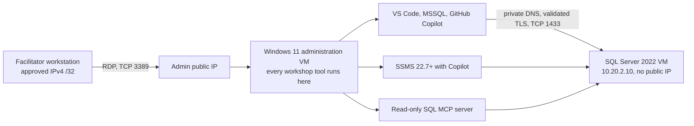

**Level:** L400
**Database:** `AdventureWorks2022`
**SQL endpoint:** private DNS `sql01.mcpworkshop.internal,1433`
**Principle:** one baseline, two independent Copilot reviews, one DBA-approved candidate, one correctness and A/B performance gate

## Outcome

Use the same deliberately inefficient stored procedure and the same measured evidence in two tools:

- **Scenario A:** RDP to the Windows 11 administration VM, connect from Visual Studio Code with MSSQL, use GitHub Copilot and the local read-only SQL MCP server.
- **Scenario B:** remain in the same RDP session, connect from SQL Server Management Studio, and use GitHub Copilot `/explain` and `/optimize` against the same source and actual execution plan.

Do not apply either generated proposal immediately. Save both reviews, reconcile them, and apply exactly one candidate through the guarded DBA approval entry point.

## How to run this workshop

### Phase 1. Deploy the environment

The facilitator runs these once from the repository root, signed in to Azure PowerShell.

| Step | Script | Purpose |
|---|---|---|
| 1 | `deploy/Test-WorkshopPrerequisites.ps1` | Read-only preflight of context, providers, quota, SKUs, images, and policy |
| 2 | `deploy/Deploy-WorkshopEnvironment.ps1` | Creates the network, both VMs, and runs guest bootstrap |
| 3 | `deploy/Capture-DeploymentEvidence.ps1` | Records the deployed state as evidence |

`-FacilitatorCidr` is the only ingress the administration NSG allows. Supply the facilitator public IPv4 as a `/32`.

Deployment proceeds through network and NAT, NSGs and ASGs, private DNS, the SQL VM, SQL bootstrap, the administration VM, and administration bootstrap. SQL bootstrap is the longest stage because it restores `AdventureWorks2022` and builds `lab.FactSales`.

Between sessions, control cost with `deploy/Stop-WorkshopEnvironment.ps1` and `deploy/Resume-WorkshopEnvironment.ps1`. Remove everything with `deploy/Remove-WorkshopEnvironment.ps1`. Resume and removal each require their confirmation phrase typed in full.

### Phase 2. Access path on workshop day

This environment contains no Azure Bastion. Access is RDP to the administration VM public IP, restricted by the administration NSG to the facilitator `/32`.



Every workshop action happens inside the administration VM. Do not try to reach SQL Server from a laptop. The SQL VM has no public IP, and that is the intended boundary rather than an obstacle to work around.

## Safety rules

1. SQL Server remains private. Never add a public IP, public SQL listener, internet firewall exception, or HTTP MCP endpoint.
2. Never paste passwords, connection strings, tokens, or unredacted infrastructure identifiers into Copilot.
3. SQL MCP is read-only and bounded. It is not an arbitrary SQL or DDL engine.
4. The baseline procedure remains unchanged.
5. A manual query execution is diagnostic evidence, not benchmark evidence.
6. Targets of 75–85% baseline and 35–45% optimized grant utilization are not measurements.
7. Candidate DDL requires explicit DBA review and the guarded approval script.
8. Correctness must pass before performance can be accepted.

## Readiness gate

Proceed only when all checks pass:

| Check | Required state |
|---|---|
| Windows 11 administration VM | Running; RDP from the approved facilitator `/32` succeeds |
| SQL VM | Running; bootstrap readiness complete |
| SQL network | No public IP; private TCP 1433 reachable only from the administration ASG |
| DNS | `sql01.mcpworkshop.internal` resolves to the SQL VM private IP |
| TLS | Encryption enabled, certificate validation enabled, hostname validated |
| VS Code | MSSQL and GitHub Copilot extensions installed |
| SQL MCP | DAB configuration validates; exactly two summary views and six custom diagnostics are visible |
| SSMS | Version 22.7 or later with AI Assistance installed |
| Authentication | GitHub Copilot interactive sign-in complete in each product |

If a readiness check fails, stop and repair that layer. Do not weaken TLS or expose SQL publicly.

---

## Shared nonoptimized workload

### Business request

Return the top month-end sales groups by territory, customer, and product. For each group calculate order count, total quantity, total sales, quantity-weighted average unit price, and global sales rank.

The complete runnable baseline definition is [sql/04-CreateBaselineProcedure.sql](https://github.com/ibranibeny/mcp-sql-query-store-workshop/blob/1aebe319edd7760a6f37fa21149c0474df23b284/sql/04-CreateBaselineProcedure.sql). It deliberately contains multiple realistic anti-patterns while remaining bounded.

### Representative nonoptimized query shape

The core baseline behavior is equivalent to the following excerpt from `lab.usp_MonthEndSalesBaseline`:

```sql
-- Deliberately non-SARGable and wide intermediate materialization.
INSERT @WideWork
    (SyntheticSalesID, TerritoryID, CustomerID, ProductID,
     OrderQty, SalesAmount, WidePayload)
SELECT
    fs.SyntheticSalesID,
    fs.TerritoryID,
    fs.CustomerID,
    fs.ProductID,
    fs.OrderQty,
    fs.SalesAmount,
    fs.WidePayload
FROM lab.FactSales AS fs
WHERE CONVERT(date, fs.OrderDate) >= @StartDate
  AND CONVERT(date, fs.OrderDate) < @EndDateExclusive;

-- Deliberately late aggregation after carrying a 400-byte payload.
INSERT @OrderStats
    (TerritoryID, CustomerID, ProductID, OrderCount,
     TotalQuantity, TotalSales, CarriedPayload)
SELECT
    w.TerritoryID,
    w.CustomerID,
    w.ProductID,
    COUNT_BIG(*),
    CONVERT(bigint, SUM(CONVERT(bigint, w.OrderQty))),
    CONVERT(decimal(38,4), SUM(CONVERT(decimal(38,4), w.SalesAmount))),
    MAX(w.WidePayload)
FROM @WideWork AS w
WHERE (@TerritoryID IS NULL OR w.TerritoryID = @TerritoryID)
GROUP BY w.TerritoryID, w.CustomerID, w.ProductID;

-- Deliberately reads the fact source a second time.
INSERT @PriceStats
    (TerritoryID, CustomerID, ProductID, AverageUnitPrice)
SELECT
    fs.TerritoryID,
    fs.CustomerID,
    fs.ProductID,
    CONVERT(decimal(19,4),
        SUM(CONVERT(decimal(38,4), fs.SalesAmount)) /
        NULLIF(SUM(CONVERT(decimal(38,4), fs.OrderQty)), 0))
FROM lab.FactSales AS fs
WHERE CONVERT(date, fs.OrderDate) >= @StartDate
  AND CONVERT(date, fs.OrderDate) < @EndDateExclusive
GROUP BY fs.TerritoryID, fs.CustomerID, fs.ProductID;
```

Expected anti-patterns to investigate, not assume as measured causes:

- `CONVERT(date, fs.OrderDate)` makes the range predicate non-SARGable.
- The 400-byte `WidePayload` is carried through intermediate work and ranking but does not affect the business result.
- Aggregation occurs after wide materialization.
- `lab.FactSales` is accessed twice.
- Ranking sorts a wider rowset than required.
- Table variables can contribute to estimate uncertainty depending on plan and compatibility behavior.
- `(@TerritoryID IS NULL OR ...)` can produce parameter-sensitive behavior.

### Bounded diagnostic invocation

Use this invocation in either editor only for a representative actual plan. The workload controller remains the benchmark authority.

```sql
USE AdventureWorks2022;
GO

DECLARE @RunId uniqueidentifier = NEWID();
EXEC sys.sp_set_session_context
    @key = N'WorkshopRunId',
    @value = @RunId;
EXEC sys.sp_set_session_context
    @key = N'WorkshopManualExecution',
    @value = 1;

SET STATISTICS IO ON;
SET STATISTICS TIME ON;

EXEC lab.usp_MonthEndSalesBaseline
    @StartDate = '2022-01-01',
    @EndDateExclusive = '2023-01-01',
    @TerritoryID = NULL,
    @TopCount = 100;

SET STATISTICS TIME OFF;
SET STATISTICS IO OFF;

EXEC sys.sp_set_session_context
    @key = N'WorkshopManualExecution',
    @value = NULL;
EXEC sys.sp_set_session_context
    @key = N'WorkshopRunId',
    @value = NULL;
GO
```

Capture:

- actual execution plan;
- Messages output for elapsed/CPU time and logical reads;
- execution start/end UTC;
- parameter values;
- Query ID and Plan ID when correlated with Query Store;
- warnings, estimates versus actual rows, grant properties, and spills.

---

## Scenario A — RDP, VS Code, MSSQL, GitHub Copilot, and SQL MCP

### A1. Enter the administration VM

1. Connect by RDP only from the approved facilitator source `/32`.
2. Sign in with the prepared workshop administrator account.
3. Open the cloned repository in Visual Studio Code.
4. Do not display or record the RDP endpoint, username, subscription, tenant, or credentials in screenshots.

### A2. Verify VS Code tooling

Confirm these extension IDs:

- `ms-mssql.mssql`
- `GitHub.copilot`
- `GitHub.copilot-chat`

Complete GitHub Copilot sign-in interactively if prompted. Authentication tokens must never pass through the model or workshop evidence.

### A3. Connect MSSQL to the private database

Create or select a connection profile with:

| Setting | Value |
|---|---|
| Server | `sql01.mcpworkshop.internal,1433` |
| Database | `AdventureWorks2022` |
| Encryption | Enabled |
| Trust server certificate | Disabled |
| Host name in certificate | `sql01.mcpworkshop.internal` |
| Authentication | Prepared least-privileged workshop or DBA credential appropriate to the action |

If connection validation fails, repair DNS, TCP 1433, certificate trust, or hostname. Do not set `TrustServerCertificate=True` as a shortcut.

### A4. Validate and start SQL MCP

From the repository root, validate the checked-in DAB configuration:

```powershell
dotnet tool run dab -- validate --config mcp/dab-config.json
```

Then:

1. Open the Command Palette.
2. Run **MCP: List Servers**.
3. Start `mcp-sql-query-store-workshop`.
4. Review the server status and output.
5. Inspect tools before approving any call.
6. Confirm `describe_entities` sees only the two configured summary views and six diagnostics.

Expected custom tools:

| Tool | Purpose |
|---|---|
| `get_memory_snapshot` | Current Resource Governor semaphore, host, process, and SQL memory context |
| `get_active_workshop_grants` | Bounded tagged request grants |
| `get_query_store_top_queries` | Runtime metrics for the two workshop procedures in a bounded UTC window |
| `get_query_store_waits` | Query Store waits in a bounded UTC window |
| `get_procedure_plan_summary` | Query/plan identity and forcing state for an exact procedure |
| `compare_workshop_runs` | Final completed-run comparison after correctness and twelve trials |

Do not approve create, update, delete, arbitrary query, DDL, workload-control, or session-termination operations.

### A5. Learn the schema with GitHub Copilot

Understand the data model before judging any optimization proposal. Schema exploration is an MSSQL extension capability, because the extension supplies live database context to Copilot Chat. The SQL MCP server cannot do this. Its `describe_entities` tool reports only the configured read-only entities and never reads user tables.

1. Expand `AdventureWorks2022` in the MSSQL object explorer.
2. Review `lab.FactSales`, its clustered key, and its existing indexes.
3. Note the declared column widths, especially `WidePayload`.

Then ask Copilot Chat one question at a time:

```text
@mssql Describe the tables in the lab schema, their primary keys, and how
lab.FactSales relates to the AdventureWorks2022 dimension tables.
```

```text
@mssql List the existing indexes on lab.FactSales. For each index state the key
columns, the included columns, and which query shapes it can serve.
```

```text
@mssql Based on this schema alone, which access path would a date-range filter on
lab.FactSales.OrderDate take today, and what would change if that predicate were
wrapped in CONVERT(date, ...)?
```

Ghost-text completions inside a `.sql` file do not carry schema context. Use `@mssql` in the chat panel when you want schema-aware answers.

Record what the schema implies before running anything. A schema reading is a hypothesis about access paths, not a measurement.

### A6. Inspect the baseline

1. Open [sql/04-CreateBaselineProcedure.sql](https://github.com/ibranibeny/mcp-sql-query-store-workshop/blob/1aebe319edd7760a6f37fa21149c0474df23b284/sql/04-CreateBaselineProcedure.sql).
2. Connect the editor to `AdventureWorks2022`.
3. Open a second editor with the bounded invocation shown above.
4. Enable **Actual Execution Plan** in MSSQL.
5. Run the invocation once.
6. Save the `.sqlplan` file and Messages output under the ignored run evidence directory.

### A7. Ask GitHub Copilot to explain

Select the baseline source and attach or reference the actual plan. In Copilot Chat use `@mssql /explain`, followed by:

```text
Analyze only the selected lab.usp_MonthEndSalesBaseline source and the attached
actual execution plan for the shown parameters. Explain the business result
contract first, then identify observed operators, estimates versus actual rows,
scan/seek behavior, sorts, hashes, joins, memory grant properties, warnings,
and spills. Do not claim causality from one execution. Do not propose DDL yet.

Use exactly these headings:
Observations
Missing evidence
Hypotheses (ranked)
Experiments
Candidate changes
Risks and rollback
Validation
```

Reject a response that does not identify the source, parameter values, plan properties, units, or missing evidence.

### A8. Ground the review with SQL MCP

In Agent mode, request only the bounded diagnostics needed for the exact run and UTC window. Approve each tool invocation individually.

Use this prompt:

```text
Use only the configured read-only SQL MCP tools. Correlate the exact baseline
run ID, UTC window, procedure, Query ID, and Plan ID. Collect a bounded memory
snapshot, tagged active grants, Query Store runtime, Query Store waits, and the
procedure plan summary. Distinguish pool utilization from requested, granted,
ideal, used, and max-used request memory. Label every unit. Do not execute DDL,
arbitrary SQL, workload control, or session termination.

Use exactly these headings:
Observations
Missing evidence
Hypotheses (ranked)
Experiments
Candidate changes
Risks and rollback
Validation
```

A point-in-time snapshot is not sufficient to classify the baseline target. The workload controller requires three consecutive samples in the target band.

### A9. Ask GitHub Copilot to optimize

Select the same baseline and include the reviewed plan and SQL MCP output. Use `@mssql /optimize`, followed by:

```text
Propose a contract-preserving optimization for lab.usp_MonthEndSalesBaseline.
Address the non-SARGable date predicate, wide intermediate payload, repeated
fact access, late aggregation, and wide ranking sort only where supported by
the supplied evidence. Evaluate a narrow covering index separately from the
query rewrite. Preserve parameter names, types, defaults, validation errors,
result columns and types, null semantics, values, row identity, ranking, and
contractual ordering. Do not alter server-wide memory settings. Do not apply
DDL. Return an unapplied Candidate A with rollback and a correctness/performance
validation plan.

Use exactly these headings:
Observations
Missing evidence
Hypotheses (ranked)
Experiments
Candidate changes
Risks and rollback
Validation
```

Save the reviewed response as `evidence/runs/<run-id>/candidate-a-vscode.md`. Generated run evidence remains ignored until human provenance and redaction review.

---

## Scenario B — RDP, SSMS, and GitHub Copilot

### B1. Open SSMS and connect

1. Stay on the same Windows 11 administration VM.
2. Open SSMS 22.7 or later.
3. Verify the **AI Assistance** workload is installed.
4. Select the GitHub Copilot badge and complete interactive sign-in.
5. Connect an active query editor to `sql01.mcpworkshop.internal` and `AdventureWorks2022` with encryption and certificate validation.

Copilot executes only with the SQL permissions of its configured login or execution context. It does not bypass SQL authorization.

### B2. Recreate the same review context

Before displaying Candidate A or the checked-in optimized procedure:

1. Open the same baseline source.
2. Open the same bounded invocation and use the same parameter set.
3. Enable **Include Actual Execution Plan**.
4. Execute once for diagnostic context.
5. Confirm the plan and results pane belong to the same source and parameters used in Scenario A.
6. Keep Candidate A hidden to preserve an independent review.

### B3. Use `/explain`

Select the baseline T-SQL in the active editor. Open GitHub Copilot Chat or inline chat and run `/explain`, followed by:

```text
Explain the selected lab.usp_MonthEndSalesBaseline as a senior SQL Server
performance engineer. Use the active AdventureWorks2022 connection and the
actual execution plan in the results pane. Define the result contract and list
only observed anti-patterns and plan properties. Separate observations from
hypotheses and identify evidence still required before optimization.

Use exactly these headings:
Observations
Missing evidence
Hypotheses (ranked)
Experiments
Candidate changes
Risks and rollback
Validation
```

### B4. Use `/optimize`

With the same T-SQL selected, run `/optimize`, followed by:

```text
Produce an unapplied Candidate B for the selected baseline. Preserve the full
stored-procedure contract. Explain whether a SARGable half-open date predicate,
early applied territory filter, narrow projection, one fact-table access,
pre-aggregation, ranking after aggregation, and a covering index are justified
by the plan. Separate index and query-shape effects. Do not execute or apply
DDL. Include semantic risks, parameter-sensitivity risks, rollback, equivalence
tests, and the unchanged A/B measurement conditions.

Use exactly these headings:
Observations
Missing evidence
Hypotheses (ranked)
Experiments
Candidate changes
Risks and rollback
Validation
```

Save the reviewed response as `evidence/runs/<run-id>/candidate-b-ssms.md`.

### B5. Optional Agent mode demonstration

SSMS 22.7 introduces Agent mode as a preview. Use it only if the workshop explicitly demonstrates multi-step orchestration:

1. Select **Agent** in the Copilot mode selector.
2. Inspect enabled `sql-tools` before use.
3. Include the server and database explicitly in the prompt.
4. Review every proposed query or command.
5. Select **Allow once** only for read-only diagnostic actions.
6. Dismiss DDL, configuration, or unrelated tool calls.

Ask mode remains preferred for the controlled Candidate B review.

---

## Reconcile, approve, and prove

### Compare Candidate A and Candidate B

Use this review matrix:

| Dimension | Candidate A | Candidate B | DBA decision |
|---|---|---|---|
| Result contract preserved | Evidence required | Evidence required | Accept/reject |
| SARGable date range | Proposed/not proposed | Proposed/not proposed | Rationale |
| Territory filtering | Location and semantics | Location and semantics | Rationale |
| Fact-table access count | Expected plan effect | Expected plan effect | Rationale |
| Projection width | Columns retained | Columns retained | Rationale |
| Aggregation grain | Exact grouping keys | Exact grouping keys | Rationale |
| Ranking and ordering | Tie behavior | Tie behavior | Rationale |
| Covering index | Keys/includes/write cost | Keys/includes/write cost | Rationale |
| Parameter sensitivity | Risks and tests | Risks and tests | Rationale |
| Rollback | Exact objects | Exact objects | Approved owner |

Agreement between Copilot responses is not proof. Compare both against the reference candidate in [sql/06-CreateOptimizedProcedure.sql](https://github.com/ibranibeny/mcp-sql-query-store-workshop/blob/1aebe319edd7760a6f37fa21149c0474df23b284/sql/06-CreateOptimizedProcedure.sql).

### Apply exactly one approved candidate

Do not run scripts 06 or 07 directly. After DBA review, use the guarded [Approve-WorkshopCandidate.ps1](https://github.com/ibranibeny/mcp-sql-query-store-workshop/blob/1aebe319edd7760a6f37fa21149c0474df23b284/deploy/Approve-WorkshopCandidate.ps1) entry point:

```powershell
$candidateDba = Get-Credential -Message 'DBA credential for approved candidate creation'
./deploy/Approve-WorkshopCandidate.ps1 `
  -Credential $candidateDba `
  -ServerInstance 'sql01.mcpworkshop.internal' `
  -ExpectedServerName 'sql01.mcpworkshop.internal' `
  -ExpectedDatabaseName 'AdventureWorks2022' `
  -ConfirmationPhrase 'APPROVE AdventureWorks2022 candidate'
```

The entry point applies the exact candidate and invokes [sql/07-ValidateEquivalence.sql](https://github.com/ibranibeny/mcp-sql-query-store-workshop/blob/1aebe319edd7760a6f37fa21149c0474df23b284/sql/07-ValidateEquivalence.sql).

### Correctness gate

Require all of the following:

- identical first-result metadata;
- matching parameter names, types, and defaults;
- matching row counts and deterministic hashes;
- empty baseline `EXCEPT` candidate result;
- empty candidate `EXCEPT` baseline result;
- matching error behavior for invalid inputs;
- matching null behavior, ranking, and ordering;
- every parameter case passes.

Any mismatch rejects the candidate regardless of speed.

### Shared performance gate

Run the bounded controller described in [Workshop 04: Create bounded query-memory pressure](04-create-memory-pressure.html). Reuse the frozen:

- worker count;
- parameter schedule and hash;
- dataset and statistics;
- index set after approved candidate creation;
- Resource Governor pool and group;
- server-memory configuration;
- database-scoped settings;
- Query Store state.

The controller performs exactly twelve interleaved `ABBA BAAB ABBA` trials. Compare actual peak/median grant utilization, duration, CPU, logical reads, spills, waits, and completed requests.

Use `compare_workshop_runs` only after the run, validation batch, frozen-settings hash, and all twelve trials are complete.

### Decision

Retain the candidate only when:

1. correctness passes;
2. query-grant utilization materially improves;
3. at least one secondary metric improves;
4. no primary metric materially regresses;
5. evidence identity and frozen settings are valid.

Use the actual classification: `TargetMet`, `ImprovedOutsideTarget`, `NoMaterialImprovement`, `BaselineTargetNotReached`, `SafetyStop`, `ManualStop`, or `Failed`.

### Screenshot checklist

Capture only after each milestone is verified:

1. RDP desktop with sensitive connection details excluded.
2. VS Code extensions and private MSSQL connection.
3. VS Code baseline source and actual plan.
4. SQL MCP tool list and bounded evidence.
5. Candidate A Copilot analysis.
6. SSMS private connection and actual plan.
7. SSMS `/explain` and `/optimize` output for Candidate B.
8. Equivalence result.
9. Final A/B evidence and outcome.

Redact public IP, subscription, tenant, usernames, credentials, tokens, and connection strings before promotion.

## Official references

- [GitHub Copilot for MSSQL in VS Code](https://learn.microsoft.com/sql/tools/visual-studio-code-extensions/github-copilot/overview?view=sql-server-ver17)
- [MSSQL query optimizer assistant](https://learn.microsoft.com/sql/tools/visual-studio-code-extensions/github-copilot/query-optimizer-assistant?view=sql-server-ver17)
- [MSSQL slash commands](https://learn.microsoft.com/sql/tools/visual-studio-code-extensions/github-copilot/slash-commands?view=sql-server-ver17)
- [GitHub Copilot in SSMS](https://learn.microsoft.com/ssms/github-copilot/overview)
- [SSMS Copilot context and slash commands](https://learn.microsoft.com/ssms/github-copilot/chat-context)
- [SSMS Agent mode](https://learn.microsoft.com/ssms/github-copilot/agent-mode)
- [SQL MCP Server overview](https://learn.microsoft.com/azure/data-api-builder/mcp/overview)
